# unified_benchmark_v4 瀹為獙缁撴灉鍒嗘瀽

鏈枃妗ｅ熀浜?`unified_benchmark_v4` 鐩綍涓殑姹囨€昏〃銆佹樉钁楁€ф楠屽拰閰嶅浘锛屽 `Local`銆乣FedAvg`銆乣FedPer`銆乣FL+MoE` 鍥涚鏂规硶鍦?14 涓珯鐐逛笂鐨勭煭鏃跺埌闀挎椂棰勬祴缁撴灉杩涜涓枃鍒嗘瀽銆傚疄楠岃缃笌 [benchmark_report.md](./benchmark_report.md) 淇濇寔涓€鑷达細`seq_len=24`锛岄娴嬫闀夸负 `1h / 6h / 24h`锛屽叡 `14` 涓珯鐐癸紙`8` 涓厜浼忕珯鐐广€乣6` 涓鐢电珯鐐癸級锛岃仈閭﹁缁冭疆鏁颁负 `3`锛屾湰鍦?epoch 涓?`2`銆?
## 1. 鍏堢湅缁撹

1. `FL+MoE` 鏄湰缁勫疄楠屼腑鐨勭患鍚堟渶浼樻柟娉曪紝灏ゅ叾鍦?`6h` 鍜?`24h` 闀挎椂棰勬祴涓紭鍔挎渶绋冲畾銆?2. `1h` 鍦烘櫙涓嬶紝`FL+MoE` 鍦ㄥ潎鍊兼寚鏍囦笂鏈€濂斤紝浣?`Local` 鍦ㄩ儴鍒嗙珯鐐逛笂鐨勭ǔ瀹氭€т粛鐒跺緢寮猴紝鍥犳涓よ€呭樊璺濆苟娌℃湁杈惧埌鈥滃叏闈㈡媺寮€鈥濈殑绋嬪害銆?3. `6h` 鏄?`FL+MoE` 浼樺娍鏈€鏄庢樉鐨勫尯闂达細鏃犺鏄?`RMSE`銆乣MAE`銆乣R2`銆乣WAPE`銆乣SMAPE` 杩樻槸 `NRMSE_range`锛屽畠閮芥帓鍦ㄧ涓€锛屼笖瀵?`Local / FedAvg / FedPer` 鐨?`RMSE` 浼樺娍鍏锋湁缁熻鏄捐憲鎬с€?4. `24h` 鏃?`FL+MoE` 渚濈劧淇濇寔鏈€浼橈紝浣嗙浉瀵?`Local` 鐨勯鍏堝箙搴﹀彉灏忥紝璇存槑闀挎椂棰勬祴涓嬬郴缁熸暣浣撻毦搴︽樉钁椾笂鍗囷紝`Local` 浠嶅叿鏈夎緝寮虹珵浜夊姏銆?5. 鍏変紡绔欑偣鏁翠綋鏄庢樉姣旈鐢电珯鐐规洿瀹规槗棰勬祴锛涚湡姝ｆ媺寮€鏂规硶宸窛鐨勬牳蹇冨満鏅槸鈥滈暱鏃舵闀?+ 椋庣數绔欑偣鈥濄€?6. `FedPer` 鍦ㄥ嚑涔庢墍鏈夊満鏅笅閮芥槸鏈€寮辨柟娉曪紝灏ゅ叾鍦ㄩ鐢甸暱鏃堕娴嬮噷浼氬嚭鐜版槑鏄剧殑宄板€间綆浼板拰鐩稿叧鎬уけ鐪熴€?
## 2. 鎸囨爣鍚箟涓庤В璇绘柟寮?
涓轰簡閬垮厤鈥滃彧鐪嬫暟瀛椼€佷笉鎳傚惈涔夆€濓紝鍏堢粺涓€瑙ｉ噴鍚勬寚鏍囥€?
- `MSE`
  鍚箟锛氳宸钩鏂圭殑骞冲潎鍊硷紝瓒婂皬瓒婂ソ銆?  瑙ｈ锛氬澶ц宸壒鍒晱鎰燂紝閫傚悎瑙傚療妯″瀷鏄惁瀛樺湪灏戦噺寰堝ぇ鐨勯娴嬪け璇€?
- `RMSE`
  鍚箟锛歚MSE` 寮€骞虫柟锛屽拰鍘熷閲忕翰涓€鑷达紝瓒婂皬瓒婂ソ銆?  瑙ｈ锛氭槸鏈枃鏈€鏍稿績鐨勮宸寚鏍囦箣涓€銆傚畠鏃繚鐣欎簡瀵瑰ぇ璇樊鐨勬儵缃氾紝鍙堟瘮 `MSE` 鏇村鏄撶洿瑙傝В閲娿€?
- `MAE`
  鍚箟锛氱粷瀵硅宸钩鍧囧€硷紝瓒婂皬瓒婂ソ銆?  瑙ｈ锛氭瘮 `RMSE` 鏇寸ǔ鍋ワ紝涓嶄細琚釜鍒紓甯哥偣杩囧害鏀惧ぇ銆傝嫢 `RMSE` 涓?`MAE` 鍚屾椂涓嬮檷锛岃鏄庢ā鍨嬬殑鏁翠綋璇樊鍜屽ぇ璇樊閮藉湪鏀瑰杽銆?
- `R2`
  鍚箟锛氬喅瀹氱郴鏁帮紝瓒婃帴杩?`1` 瓒婂ソ銆?  瑙ｈ锛氬弽鏄犳ā鍨嬪鐩爣娉㈠姩鐨勮В閲婅兘鍔涖€俙R2 < 0` 璇存槑妯″瀷宸茬粡宸埌鈥滀笉濡傜洿鎺ョ敤鍧囧€尖€濄€?
- `MBE`
  鍚箟锛氬钩鍧囧亸宸宸紝鍙互涓烘涔熷彲浠ヤ负璐燂紝缁濆鍊艰秺鎺ヨ繎 `0` 瓒婂ソ銆?  瑙ｈ锛歚MBE > 0` 鍊惧悜杩囬娴嬶紝`MBE < 0` 鍊惧悜浣庝及銆傚畠涓嶆槸鐪嬬簿搴﹂珮浣庯紝鑰屾槸鐪嬪亸宸柟鍚戙€?
- `SMAPE`
  鍚箟锛氬绉板钩鍧囩粷瀵圭櫨鍒嗘瘮璇樊锛岃秺灏忚秺濂姐€?  瑙ｈ锛氶€傚悎涓嶅悓閲忕骇涔嬮棿鍋氱浉瀵硅宸瘮杈冿紝浣嗗湪鎺ヨ繎闆跺€煎尯闂翠細鏇存晱鎰熴€?
- `WAPE`
  鍚箟锛氬姞鏉冪粷瀵圭櫨鍒嗘瘮璇樊锛岃秺灏忚秺濂姐€?  瑙ｈ锛氬彲浠ョ悊瑙ｄ负鈥滄€讳綋缁濆璇樊鍗犳€讳綋鐪熷疄鍊肩殑姣斾緥鈥濓紝姣旈€愮偣鐧惧垎姣旇宸洿绋筹紝閫傚悎鍏ㄧ珯鐐规眹鎬诲垎鏋愩€?
- `NRMSE_range`
  鍚箟锛氱敤鏁版嵁鑼冨洿褰掍竴鍖栧悗鐨?`RMSE`锛岃秺灏忚秺濂姐€?  瑙ｈ锛氶€傚悎涓嶅悓绔欑偣銆佷笉鍚岀被鍨嬩箣闂村仛鍏钩姣旇緝銆傛湰鏂囧緢澶氳法绔欑偣缁撹鍙互鍙傝€冭鎸囨爣銆?
- `NMAE_range`
  鍚箟锛氱敤鏁版嵁鑼冨洿褰掍竴鍖栧悗鐨?`MAE`锛岃秺灏忚秺濂姐€?  瑙ｈ锛氫笌 `NRMSE_range` 绫讳技锛屼絾鏇村己璋冨钩鍧囪宸€屼笉鏄ぇ璇樊銆?
- `corr`
  鍚箟锛氶娴嬪€间笌鐪熷疄鍊肩殑鐩稿叧绯绘暟锛岃秺鎺ヨ繎 `1` 瓒婂ソ銆?  瑙ｈ锛氬弽鏄犳ā鍨嬫槸鍚︽姄浣忎簡娉㈠姩瓒嬪娍銆傜浉鍏虫€ч珮锛屼笉涓€瀹氳宸渶灏忥紱浣嗙浉鍏虫€т綆閫氬父鎰忓懗鐫€褰㈢姸閮芥病鏈夊涓娿€?
涓€涓疄鐢ㄥ垽鏂師鍒欐槸锛?
- `RMSE / MAE / WAPE / NRMSE_range` 涓昏鐪嬧€滆宸箙搴︹€濄€?- `R2 / corr` 涓昏鐪嬧€滄尝鍔ㄨ秼鍔垮拰瑙ｉ噴鑳藉姏鈥濄€?- `MBE` 涓昏鐪嬧€滅郴缁熸€ч珮浼拌繕鏄綆浼扳€濄€?
## 3. 鏁翠綋琛ㄧ幇锛歚FL+MoE` 鐨勪紭鍔块泦涓湪涓暱鏃堕娴?
### 3.1 鍚勬闀挎牳蹇冩寚鏍囧潎鍊?
| 姝ラ暱 | 鏂规硶 | RMSE | MAE | R2 | WAPE | SMAPE | corr |
|---|---|---:|---:|---:|---:|---:|---:|
| 1h | FL+MoE | **6.554** | **4.137** | **0.861** | **23.543** | **90.023** | 0.936 |
| 1h | Local | 6.738 | 4.507 | 0.820 | 25.095 | 94.136 | 0.931 |
| 1h | FedAvg | 7.079 | 4.827 | 0.851 | 27.221 | 95.914 | **0.936** |
| 1h | FedPer | 12.689 | 8.992 | 0.351 | 49.907 | 113.515 | 0.927 |
| 6h | FL+MoE | **11.632** | **8.003** | **0.620** | **45.642** | **99.527** | **0.799** |
| 6h | Local | 12.221 | 8.607 | 0.544 | 48.891 | 106.145 | 0.780 |
| 6h | FedAvg | 13.158 | 9.429 | 0.493 | 52.348 | 106.000 | 0.779 |
| 6h | FedPer | 16.961 | 12.325 | -0.250 | 65.910 | 120.618 | 0.715 |
| 24h | FL+MoE | **14.475** | **10.928** | **0.390** | **57.624** | **104.881** | **0.661** |
| 24h | Local | 14.740 | 11.155 | 0.336 | 59.870 | 109.945 | 0.563 |
| 24h | FedAvg | 15.650 | 12.215 | 0.248 | 64.382 | 113.201 | 0.653 |
| 24h | FedPer | 18.728 | 14.055 | -0.379 | 74.575 | 127.448 | 0.543 |

浠庡潎鍊肩粨鏋滅湅锛宍FL+MoE` 鍦ㄤ笁涓闀夸笂閮芥嬁鍒颁簡鏈€濂界殑 `RMSE / MAE / R2 / WAPE / SMAPE`銆傝繖璇存槑鍏朵紭鍔夸笉鏄崟涓€鎸囨爣涓婄殑鍋剁劧锛岃€屾槸鍏奸【浜嗙粷瀵硅宸€佺浉瀵硅宸拰鎷熷悎瑙ｉ噴鑳藉姏銆?
### 3.2 姝ラ暱澧炲姞鍚庯紝鍚勬柟娉曢兘閫€鍖栵紝浣嗛€€鍖栭€熷害涓嶅悓

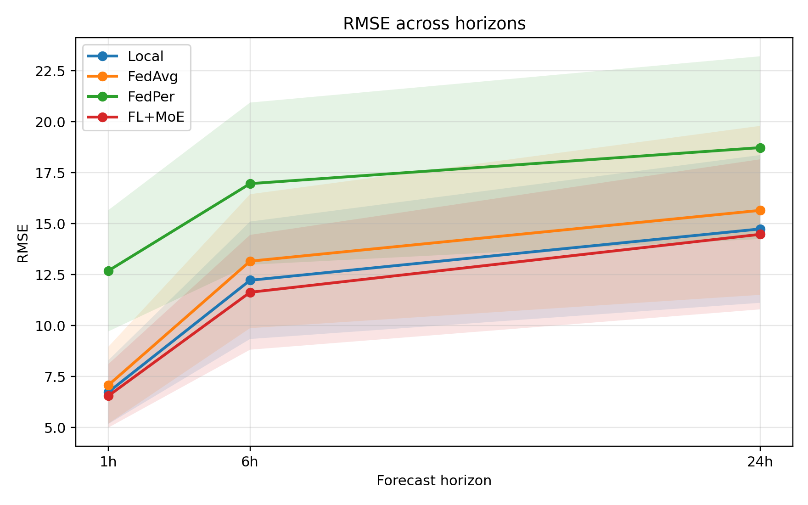

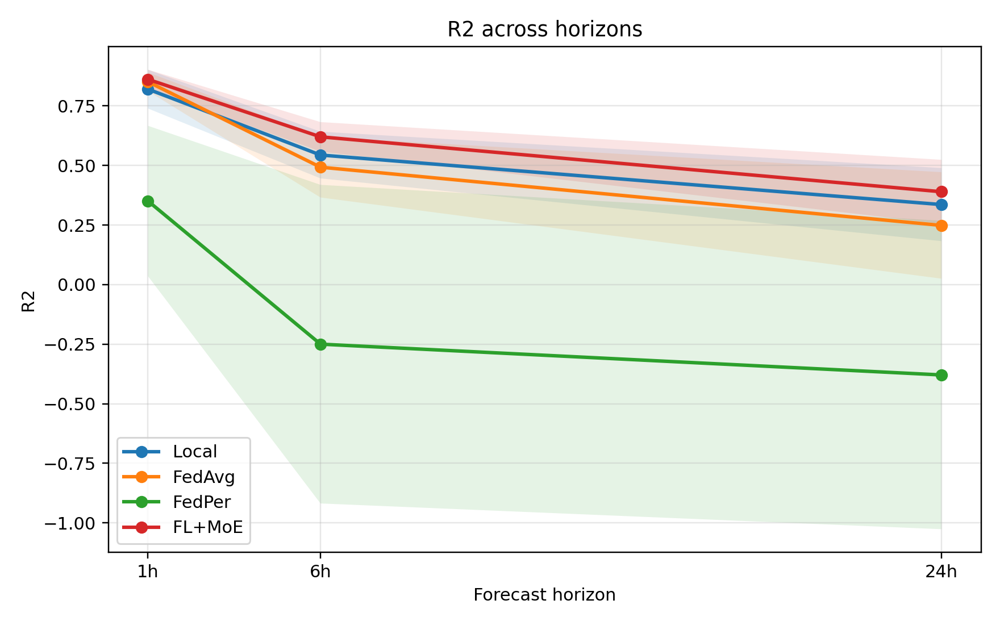

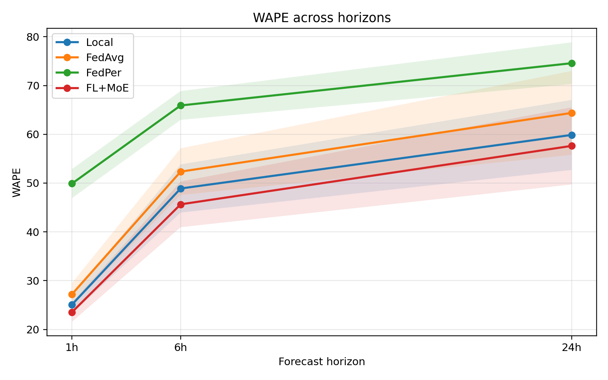

浠庝笁寮犺法姝ラ暱鏇茬嚎鍙互鐪嬪埌锛?
- 鎵€鏈夋柟娉曠殑 `RMSE` 閮介殢姝ラ暱澧炲姞鑰屼笂鍗囷紝杩欐槸闀挎椂棰勬祴涓嶇‘瀹氭€у鍔犵殑姝ｅ父鐜拌薄銆?- `FL+MoE` 鐨勬洸绾垮缁堜綅浜庢渶涓嬫柟鎴栨帴杩戞渶涓嬫柟锛岃鏄庡叾璇樊澧為暱閫熷害鏈€鎱€?- `R2` 涓婏紝`FL+MoE` 浠?`0.861 -> 0.620 -> 0.390`锛岃櫧鐒朵篃鏄庢樉涓嬮檷锛屼絾濮嬬粓棰嗗厛鍏朵粬鏂规硶銆?- `FedPer` 鐨勯€€鍖栨渶鍓х儓锛宍R2` 鍦?`6h` 鍜?`24h` 宸茬粡涓鸿礋锛岃鏄庡畠宸茬粡鏃犳硶绋冲畾瑙ｉ噴鐪熷疄娉㈠姩銆?
濡傛灉鎸?`RMSE` 鐩稿鏀硅繘骞呭害绮楃暐璁＄畻锛?
- `1h`锛歚FL+MoE` 鐩稿 `Local` 绾︿笅闄?`2.7%`锛岀浉瀵?`FedAvg` 绾︿笅闄?`7.4%`銆?- `6h`锛歚FL+MoE` 鐩稿 `Local` 绾︿笅闄?`4.8%`锛岀浉瀵?`FedAvg` 绾︿笅闄?`11.6%`锛岀浉瀵?`FedPer` 绾︿笅闄?`31.4%`銆?- `24h`锛歚FL+MoE` 鐩稿 `Local` 绾︿笅闄?`1.8%`锛岀浉瀵?`FedAvg` 绾︿笅闄?`7.5%`锛岀浉瀵?`FedPer` 绾︿笅闄?`22.7%`銆?
杩欒鏄?`FL+MoE` 鐨勬渶澶т环鍊间笉鍦ㄢ€滄瀬鐭湡寰急鎻愮偣鈥濓紝鑰屽湪鈥滀腑闀挎椂鍦烘櫙涓嬫槑鏄炬姂鍒舵€ц兘琛板噺鈥濄€?
## 4. 鍒嗘闀胯缁嗗垎鏋?
### 4.1 1h锛歚FL+MoE` 鍧囧€兼渶浼橈紝浣?`Local` 浠嶇劧寰堟湁绔炰簤鍔?
鍦?`1h` 鍦烘櫙涓嬶細

- `FL+MoE` 鐨?`RMSE=6.554`銆乣MAE=4.137`銆乣R2=0.861`銆乣WAPE=23.543` 鍧囦负鏈€浼樸€?- 浣嗕粠骞冲潎鍚嶆鐪嬶紝`Local` 鍦?`RMSE / R2 / NRMSE_range` 涓婄殑骞冲潎鎺掑悕鏇村ソ锛?  - `Local` 鐨?`RMSE` 骞冲潎鍚嶆涓?`1.786`
  - `FL+MoE` 鐨?`RMSE` 骞冲潎鍚嶆涓?`2.000`
- `RMSE` 鑳滃満鏁颁篃鏄剧ず锛歚Local` 鍦?`14` 涓珯鐐逛腑璧簡 `6` 涓紝`FL+MoE` 璧簡 `4` 涓紝`FedAvg` 涔熻耽浜?`4` 涓€?
杩欒鏄庣煭鏃堕娴嬩笅锛岀珯鐐逛釜浣撳樊寮備粛鐒跺緢寮猴紝`FL+MoE` 铏界劧鎬讳綋骞冲潎鏈€濂斤紝浣嗗苟涓嶆槸鍦ㄦ墍鏈夌珯鐐归兘褰㈡垚鍘嬪€掓€т紭鍔裤€?
鏄捐憲鎬ф楠屼篃鏀寔杩欎釜鍒ゆ柇锛?
- `1h` 涓?`Local vs FL+MoE` 鐨?`RMSE`锛歚p=0.8077`锛屼笉鏄捐憲銆?- `1h` 涓?`FedAvg vs FL+MoE` 鐨?`RMSE`锛歚p=0.1531`锛屼笉鏄捐憲銆?- 浣?`FedPer vs FL+MoE` 鐨?`RMSE`锛歚p=0.000244`锛屾樉钁椼€?
鍥犳锛宍1h` 鐨勬纭粨璁轰笉鏄€淔L+MoE 宸茬粡鍏ㄩ潰纰惧帇鎵€鏈夋柟娉曗€濓紝鑰屾槸锛?
- 瀹冨凡缁忔嬁鍒版渶浼樺潎鍊肩粨鏋滐紱
- 浣嗙浉瀵?`Local` 鍜?`FedAvg` 鐨勪紭鍔胯繕澶勪簬鈥滄暟鍊奸鍏堛€佺粺璁′笂鏈畬鍏ㄦ媺寮€鈥濈殑鐘舵€併€?
### 4.2 6h锛歚FL+MoE` 鐨勬渶寮轰紭鍔垮尯闂?
`6h` 鏄湰瀹為獙涓?`FL+MoE` 鏈€浜溂鐨勫尯闂淬€?
- `RMSE=11.632`锛屼紭浜?`Local=12.221`銆乣FedAvg=13.158`銆乣FedPer=16.961`
- `R2=0.620`锛屾槑鏄鹃珮浜?`Local=0.544` 鍜?`FedAvg=0.493`
- `WAPE=45.642`锛屼篃鏄捐憲浣庝簬鍏朵粬鏂规硶

骞冲潎鍚嶆鏂归潰锛宍FL+MoE` 鍦ㄥ涓牳蹇冩寚鏍囦笂閮芥帴杩戠悊璁烘渶浼橈細

- `RMSE` 骞冲潎鍚嶆锛歚1.214`
- `R2` 骞冲潎鍚嶆锛歚1.214`
- `NRMSE_range` 骞冲潎鍚嶆锛歚1.214`
- `SMAPE` 骞冲潎鍚嶆锛歚1.286`
- `MAE` 骞冲潎鍚嶆锛歚1.357`

鑳滃満缁熻涔熷緢鏈夎鏈嶅姏锛?
- `RMSE`锛歚FL+MoE` 鍦?`14` 涓珯鐐逛腑璧簡 `11` 涓?- `MAE`锛氳耽浜?`10` 涓?- `WAPE`锛氳耽浜?`10` 涓?- `SMAPE`锛氳耽浜?`11` 涓?- `corr`锛氳耽浜?`9` 涓?
鏄捐憲鎬ф楠岃繘涓€姝ヨ鏄庯紝杩欎笉鏄伓鐒舵尝鍔細

- `6h, RMSE, Local vs FL+MoE`锛歚p=0.00305`锛屾樉钁?- `6h, RMSE, FedAvg vs FL+MoE`锛歚p=0.00305`锛屾樉钁?- `6h, RMSE, FedPer vs FL+MoE`锛歚p=0.000122`锛屾樉钁?
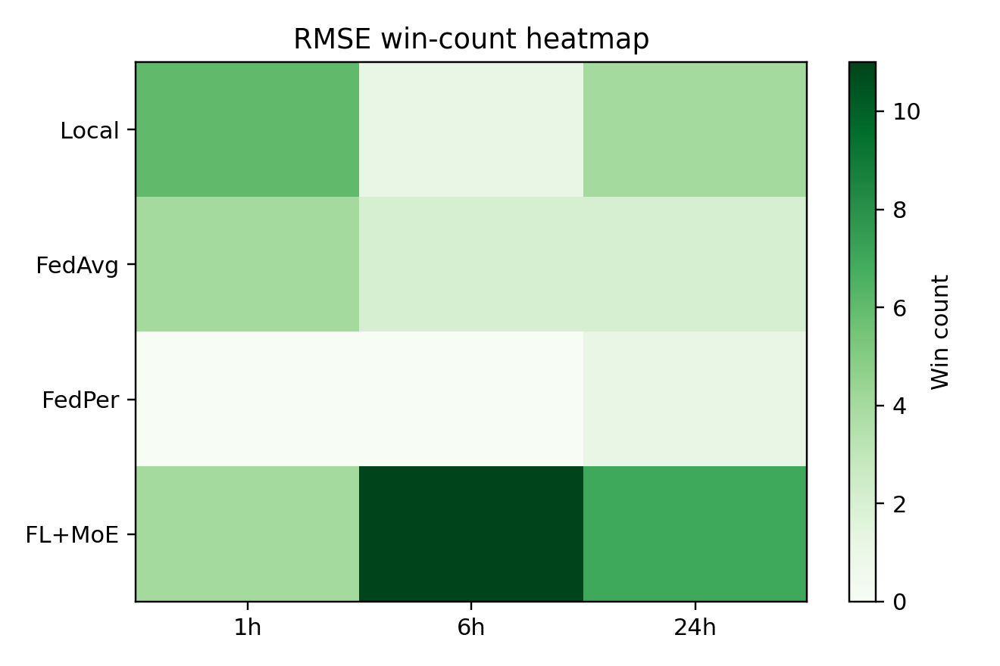

杩欏紶鍥句篃闈炲父鐩磋锛氬湪 `6h` 涓€鍒椾腑锛宍FL+MoE` 鐨勭豢鑹叉渶娣憋紝璇存槑瀹冨湪绔欑偣绾ц儨鍦轰笂鍗犳嵁缁濆浼樺娍銆?
缁撳悎 [prediction_examples_h6.png](./figures/prediction_examples_h6.png) 鍙互鐪嬪埌锛宍FL+MoE` 鍦ㄥ嘲鍊间綅缃拰鏁翠綋娉㈠舰涓婇€氬父姣?`FedAvg` 鏇寸ǔ锛屾瘮 `FedPer` 鏇翠笉瀹规槗鍑虹幇鏄庢樉鐨勫嘲鍊煎帇缂┿€備篃灏辨槸璇达紝瀹冧笉浠呭噺灏戜簡鏁板€艰宸紝杩樻洿濂藉湴淇濈暀浜嗙湡瀹炴洸绾跨殑褰㈢姸銆?
### 4.3 24h锛歚FL+MoE` 浠嶆渶浼橈紝浣嗏€滅粷瀵逛紭鍔库€濆急浜?6h

鍦?`24h` 棰勬祴涓婏紝闅惧害鏄捐憲涓婂崌锛?
- `FL+MoE` 鐨?`RMSE` 涓婂崌鍒?`14.475`
- `R2` 涓嬮檷鍒?`0.390`
- `WAPE` 涓婂崌鍒?`57.624`

灏界濡傛锛屽畠浠嶇劧鏄患鍚堟渶浼樻柟娉曪細

- `RMSE=14.475`锛屽洓鏂规硶鏈€浣?- `MAE=10.928`锛屽洓鏂规硶鏈€浣?- `R2=0.390`锛屽洓鏂规硶鏈€楂?- `WAPE=57.624`锛屽洓鏂规硶鏈€浣?
浣嗚繖閲岄渶瑕侀潪甯稿瑙傚湴鐪嬪緟宸窛锛?
- `FL+MoE` 鐩稿 `FedAvg` 鐨勬彁鍗囨瘮杈冩槑纭紝`24h, RMSE` 妫€楠?`p=0.00403`锛屾樉钁椼€?- `FL+MoE` 鐩稿 `FedPer` 鐨勬彁鍗囨洿鏄捐憲锛宍24h, RMSE` 妫€楠?`p=0.000244`銆?- `FL+MoE` 鐩稿 `Local` 鐨?`RMSE` 铏界劧鏁板€兼洿浼橈紝浣?`p=0.0906`锛屾湭杈惧埌鏄捐憲姘村钩銆?
杩欒鏄庡湪鏈€闀挎闀夸笅锛?
- `FL+MoE` 渚濈劧鏄渶濂界殑鏂规硶锛?- 浣嗗畠涓庡己鍩虹嚎 `Local` 鐨勫樊璺濆凡缁忕缉灏忓埌鈥滄暟鍊奸鍏堛€佺粺璁′笂杈圭紭鈥濈殑绋嬪害銆?
涓嶈繃濡傛灉鐪嬬浉瀵硅宸寚鏍囷紝瀹冪殑浼樺娍浠嶇劧姣旇緝绋冲畾銆備互 `WAPE` 涓轰緥锛?
- `FL+MoE` 鐩稿 `FedAvg`锛歚57.624 vs 64.382`锛屽樊璺濇樉钁楋紝`p=0.000122`
- `FL+MoE` 鐩稿 `FedPer`锛歚57.624 vs 74.575`锛屽樊璺濇樉钁楋紝`p=0.001709`
- `FL+MoE` 鐩稿 `Local`锛歚57.624 vs 59.870`锛屾暟鍊兼洿浼橈紝浣?`p=0.1040`锛屾湭鏄捐憲

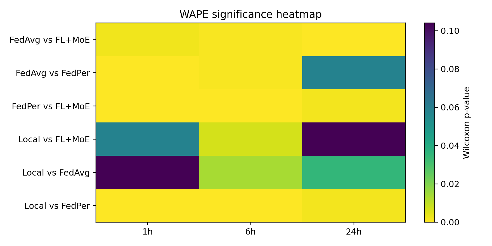

杩欏紶鍥剧粰鍑虹殑淇℃伅寰堝叧閿細`FL+MoE` 瀵?`FedAvg`銆乣FedPer` 鐨勪紭鍔垮湪 `24h` 涓嬩粛鐒堕潪甯哥ǔ瀹氾紝浣嗗 `Local` 骞舵病鏈夊湪鎵€鏈夎宸寚鏍囦笂褰㈡垚缁濆鏄捐憲宸紓銆?
## 5. 椋庣數 vs 鍏変紡锛氱湡姝ｉ毦鐨勬槸椋庣數闀挎椂棰勬祴

### 5.1 鍏変紡鏁翠綋鏇村鏄擄紝椋庣數鏁翠綋鏇撮毦

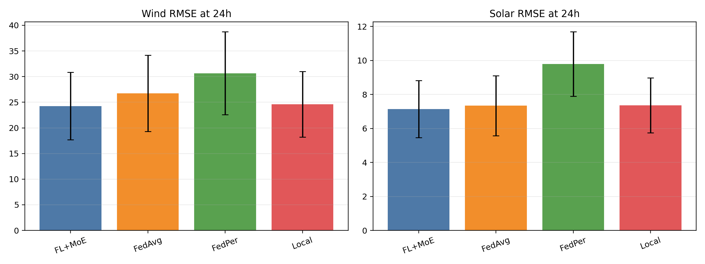

浠?`24h` 绫诲瀷鍒嗚В缁撴灉鐪嬶細

- `FL+MoE` 鍦ㄥ厜浼忎笂鐨?`RMSE` 浠呬负 `7.141`
- 浣嗗湪椋庣數涓婄殑 `RMSE` 杈惧埌 `24.254`

涔熷氨鏄锛屽悓涓€鏂规硶涓嬶紝椋庣數 `24h` 棰勬祴璇樊绾︿负鍏変紡鐨?`3.4` 鍊嶃€傝繖涓樊璺濊鏄庯細

- 鍏変紡搴忓垪鐨勬棩鍛ㄦ湡鏇寸ǔ瀹氾紝妯″紡鏇村鏄撳鍒帮紱
- 椋庣數搴忓垪娉㈠姩鏇翠笉瑙勫垯锛岄暱鏃堕娴嬬殑涓嶇‘瀹氭€ц繙楂樹簬鍏変紡銆?
### 5.2 `FL+MoE` 鐨勪环鍊间富瑕佷綋鐜板湪鈥滈鐢甸暱鏃垛€濆満鏅?
鍦?`24h` 椋庣數鍦烘櫙锛?
- `FL+MoE`锛歚RMSE=24.254`锛宍R2=-0.089`锛宍WAPE=79.456`
- `Local`锛歚RMSE=24.588`锛宍R2=-0.175`锛宍WAPE=78.398`
- `FedAvg`锛歚RMSE=26.735`锛宍R2=-0.412`锛宍WAPE=88.722`
- `FedPer`锛歚RMSE=30.644`锛宍R2=-1.559`锛宍WAPE=85.000`

鍙互鐪嬪埌锛?
- `FL+MoE` 鏄庢樉浼樹簬 `FedAvg / FedPer`
- 鐩稿 `Local`锛宍RMSE` 鍜?`R2` 閮芥洿濂?- 灏ゅ叾鏄?`R2` 浠?`Local` 鐨?`-0.175` 鎻愬崌鍒?`-0.089`锛岃鏄庡嵆浣块暱鏃堕鐢垫瀬闅撅紝瀹冧粛淇濈暀浜嗘洿澶氬彲瑙ｉ噴娉㈠姩

鑰屽湪鍏変紡 `24h` 鍦烘櫙锛屽洓绉嶆柟娉曚箣闂村樊璺濆弽鑰屾洿灏忥細

- `FL+MoE`锛歚RMSE=7.141`
- `Local`锛歚RMSE=7.353`
- `FedAvg`锛歚RMSE=7.337`
- `FedPer`锛歚RMSE=9.790`

杩欒鏄庯細

- 鍏変紡浠诲姟鏈韩宸茬浉瀵瑰鏄擄紝鑱旈偊鏂规硶涔嬮棿鐨勫樊璺濅笉瀹规槗琚斁澶э紱
- 椋庣數浠诲姟鏇磋兘浣撶幇妯″瀷缁撴瀯璁捐鐨勪紭鍔ｏ紝`FL+MoE` 鐨勪笓瀹跺垎宸ヨ兘鍔涘湪杩欓噷鏇存湁浠峰€笺€?
## 6. 骞冲潎鍚嶆涓庤儨鍦猴細涓轰粈涔堣 `FL+MoE` 鏄€滅患鍚堟渶浼樷€?
骞冲潎鍊兼湁鏃朵細琚瀬绔珯鐐瑰奖鍝嶏紝鎵€浠ヨ繕瑕佺湅绔欑偣绾ф帓鍚嶃€?
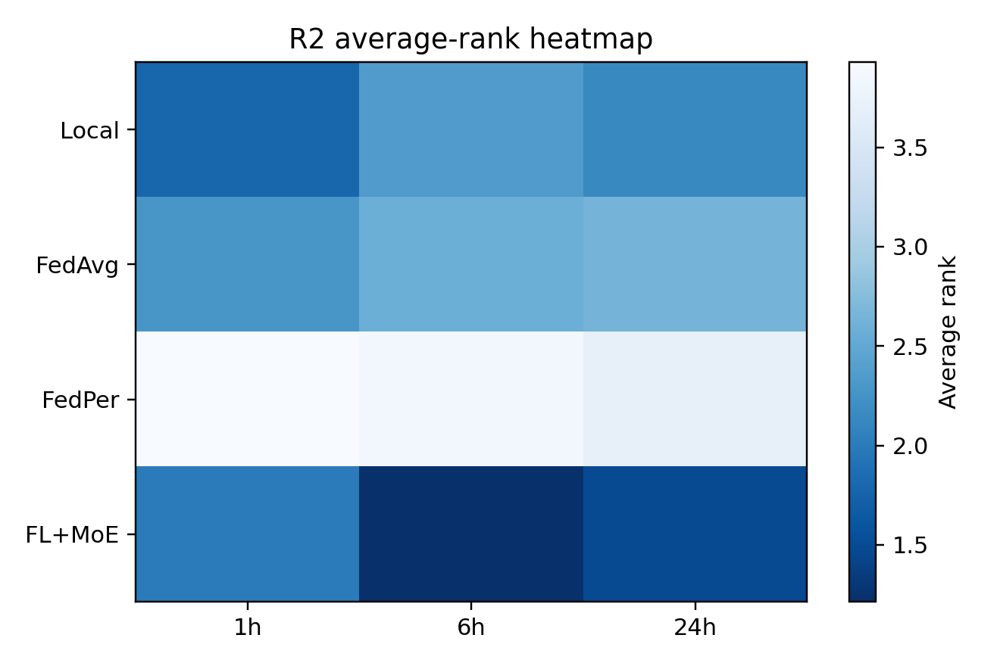

浠庡钩鍧囧悕娆¤搴︼細

- `1h`锛歚Local` 涓?`FL+MoE` 寰堟帴杩戯紝鐢氳嚦鍦?`RMSE / R2 / NRMSE_range` 涓婄暐浼?- `6h`锛歚FL+MoE` 鍑犱箮鍦ㄦ墍鏈夋牳蹇冩寚鏍囦笂鎺掑悕绗竴
- `24h`锛歚FL+MoE` 渚濈劧绗竴锛屼絾 `Local` 鏄渶寮鸿拷璧惰€?
杩欎笌鍓嶉潰鐨勫潎鍊煎垎鏋愭槸涓€鑷寸殑锛?
- `1h` 鏄兌鐫€鐘舵€?- `6h` 鏄?`FL+MoE` 鐨勪紭鍔垮尯
- `24h` 鏄?`FL+MoE` 浠嶆渶浼樸€佷絾浼樺娍缂╃獎

濡傛灉鍙湅绔欑偣鑳滃満锛岀粨璁轰篃寰堟竻鏅帮細

- `1h, RMSE`锛歚Local` 璧?`6` 绔欙紝`FL+MoE` 璧?`4` 绔?- `6h, RMSE`锛歚FL+MoE` 璧?`11` 绔?- `24h, RMSE`锛歚FL+MoE` 璧?`7` 绔欙紝`Local` 璧?`4` 绔?
鎵€浠ワ紝`FL+MoE` 鐨勪紭鍔夸笉鏄€滄瘡涓珯鐐归兘鍘嬭繃鍩虹嚎鈥濓紝鑰屾槸锛?
- 鍦ㄤ腑闀挎椂棰勬祴閲岋紝瀹冭兘鍦ㄦ洿澶氱珯鐐逛笂鍙栧緱绗竴锛?- 鍦ㄦ暣浣撴眹鎬绘椂锛屽畠鐨勮宸潎鍊煎拰鎺掑悕鏇寸ǔ瀹氥€?
## 7. 鏄捐憲鎬ф楠岋細鍝簺宸窛鏄湡鐨勶紝鍝簺鍙槸鏁板€奸鍏?
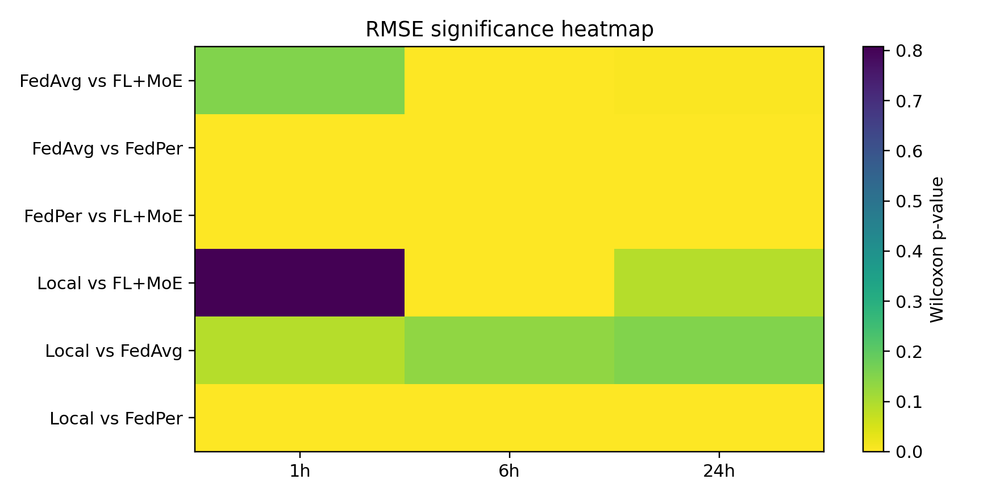

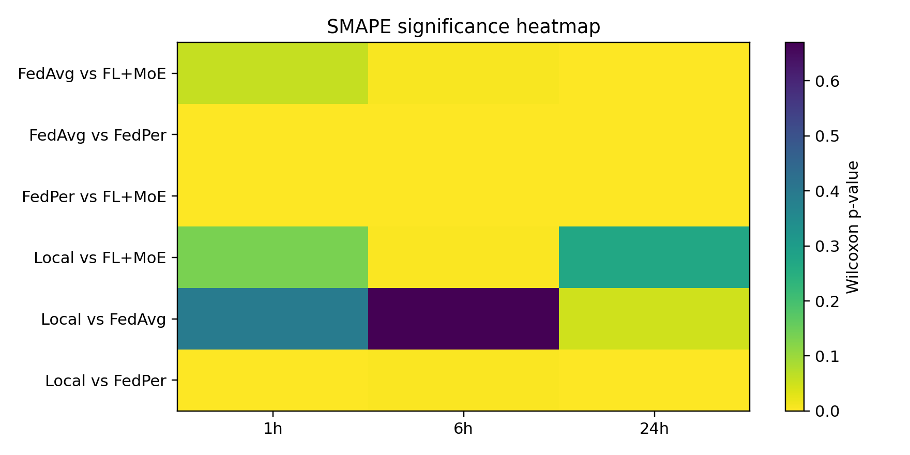

浠庢樉钁楁€ф楠屽彲浠ユ€荤粨鍑轰笁鏉￠噸瑕佺粨璁猴細

1. `FL+MoE` 鐩稿 `FedPer` 鐨勪紭鍔垮嚑涔庢槸鍏ㄩ潰鏄捐憲鐨勩€?   杩欒鏄?`FedPer` 鍦ㄨ繖缁勪换鍔′笂涓嶉€傚悎浣滀负寮虹珵浜夋柟妗堛€?
2. `FL+MoE` 鐩稿 `FedAvg` 鐨勪紭鍔垮湪 `6h` 鍜?`24h` 鏄庢樉澧炲己銆?   鍏稿瀷渚嬪瓙鏄細
   - `6h, RMSE`锛歚p=0.00305`
   - `24h, RMSE`锛歚p=0.00403`
   - `24h, WAPE`锛歚p=0.000122`

3. `FL+MoE` 鐩稿 `Local` 鐨勪紭鍔挎槸鈥滅湡瀹炲瓨鍦ㄤ絾涓嶆€绘樉钁椻€濄€?   渚嬪锛?   - `1h, RMSE`锛歚p=0.8077`锛屼笉鏄捐憲
   - `6h, RMSE`锛歚p=0.00305`锛屾樉钁?   - `24h, RMSE`锛歚p=0.0906`锛屼笉鏄捐憲
   - `24h, WAPE`锛歚p=0.1040`锛屼笉鏄捐憲

鍥犳锛屽瀹為獙缁撹鏈€涓ヨ皑鐨勮〃杩板簲璇ユ槸锛?
- `FL+MoE` 鏄庣‘浼樹簬 `FedAvg` 鍜?`FedPer`锛?- 瀵?`Local`锛屼紭鍔垮湪 `6h` 鏈€鏈夎鏈嶅姏锛屽湪 `1h` 鍜?`24h` 鏇村浣撶幇涓衡€滅患鍚堟洿浼橈紝浣嗘湭瀹屽叏鏄捐憲鎷夊紑鈥濄€?
## 8. 绔欑偣灞傞潰锛氶毦鐐归泦涓湪灏戞暟椋庣數绔?
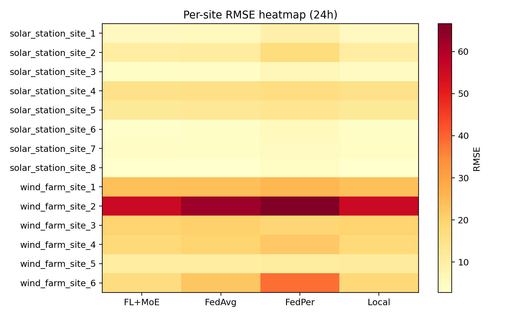

绔欑偣鐑姏鍥鹃潪甯稿€煎緱閲嶈锛屽洜涓哄畠鍛婅瘔鎴戜滑鈥滆宸槸骞冲潎鍒嗗竷鐨勶紝杩樻槸鐢卞皯鏁伴毦绔欑偣涓诲鐨勨€濄€?
浠?`24h` 鐑姏鍥惧拰鍘熷缁撴灉鐪嬶細

- 鍏変紡绔欑偣鏁翠綋閮藉浜庢祬鑹插尯鍩燂紝璇樊姘村钩浣庝笖鏂规硶闂村樊寮傛湁闄愩€?- 椋庣數绔欑偣璇樊鏅亶鏇撮珮锛屾槸鏁翠綋璇樊鐨勪富瑕佹潵婧愩€?- `wind_farm_site_2` 鏄渶闅剧珯鐐逛箣涓€锛岃€屼笖鍥涚鏂规硶閮借〃鐜拌緝宸細
  - `Local RMSE 鈮?55.45`
  - `FL+MoE RMSE 鈮?55.99`
  - `FedAvg RMSE 鈮?62.68`
  - `FedPer RMSE 鈮?66.60`
- `wind_farm_site_6` 瀵?`FedPer` 鐗瑰埆涓嶅弸濂斤紝鍑虹幇浜嗘槑鏄惧け绋筹細
  - `FedPer RMSE 鈮?38.58`
  - 鍚屾椂鐩稿叧绯绘暟涓鸿礋锛宍corr 鈮?-0.636`

杩欒〃鏄庯細

- 瀹為獙鏁翠綋闅惧害骞朵笉鏄潎鍖€鍒嗗竷鐨勶紱
- 鐪熸鍐冲畾妯″瀷涓婇檺鐨勬槸灏戞暟娉㈠姩鏋佸己銆侀潪骞崇ǔ鎬ф洿楂樼殑椋庣數绔欙紱
- `FL+MoE` 鐨勮础鐚富瑕佷綋鐜板湪杩欎簺闅剧珯鐐逛笂鍑忓皯澶辨帶姒傜巼锛岃€屼笉鏄湪绠€鍗曠珯鐐逛笂缁х画鈥滃埛灏忔暟鐐光€濄€?
## 9. 棰勬祴鏇茬嚎褰㈡€侊細`FL+MoE` 鏇存帴杩戠湡瀹炲嘲鍊硷紝浣嗛暱鏃朵粛鏈夊嘲鍊煎帇缂?
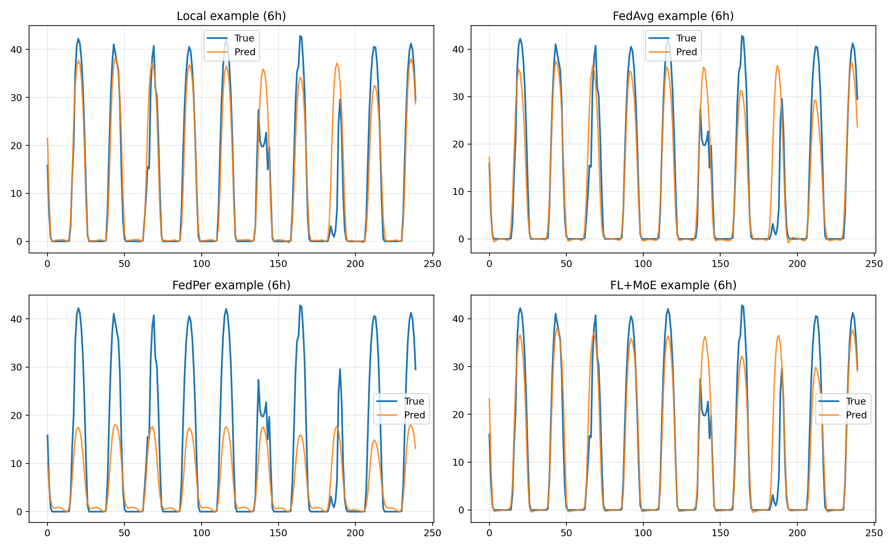

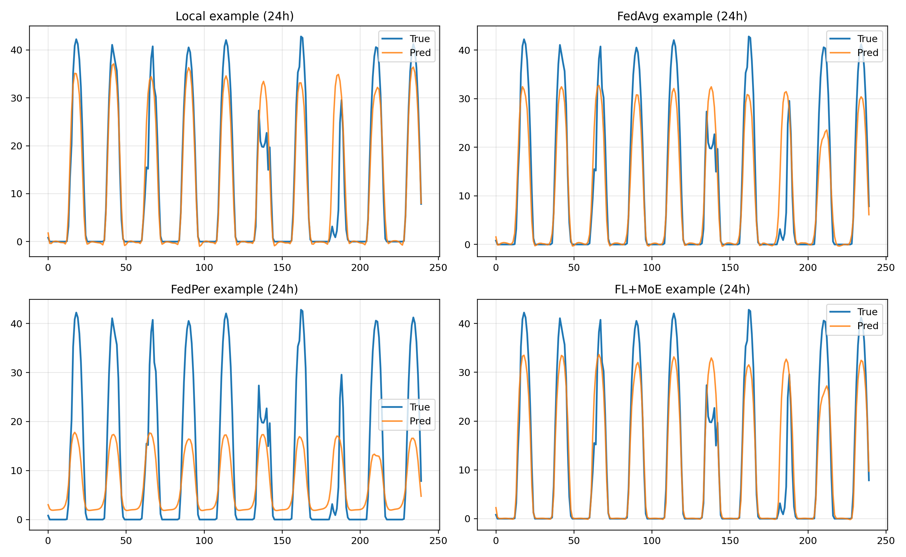

浠庢牱渚嬪浘鍙互鐪嬪嚭鍑犱釜閲嶈鐜拌薄锛?
1. 鍥涚鏂规硶閮借兘瀛﹀埌鏄庢樉鐨勬棩鍛ㄦ湡缁撴瀯锛岃繖涔熸槸涓轰粈涔堢煭鏃跺拰鍏変紡浠诲姟鏁翠綋涓嶇畻澶樊銆?2. `FedPer` 鍦ㄥ嘲鍊煎鏈€瀹规槗鍑虹幇绯荤粺鎬т綆浼帮紝棰勬祴鏇茬嚎鎸箙鏄庢樉琚帇鎵併€?3. `FL+MoE` 鍦?`6h` 鍜?`24h` 涓嬶紝宄板€奸珮搴﹂€氬父鏇存帴杩戠湡瀹炲€硷紝娉㈠舰涔熸洿骞虫粦銆?4. 浣嗗嵆浣挎槸 `FL+MoE`锛屽湪闀挎椂棰勬祴鏃朵粛瀛樺湪宄板€煎帇缂╁拰灞€閮ㄩ敊浣嶏紝璇存槑闀挎椂搴忎笉纭畾鎬у苟娌℃湁琚畬鍏ㄨВ鍐炽€?
杩欎竴瑙傚療涓?`MBE` 缁撴灉楂樺害涓€鑷达細

- `FL+MoE` 鐨?`MBE` 鍒嗗埆涓?`0.059 / 0.153 / -1.220`
- `Local` 涓?`-0.482 / -1.383 / -1.425`
- `FedAvg` 涓?`-1.231 / -2.047 / -2.697`
- `FedPer` 涓?`-7.235 / -8.443 / -8.086`

涔熷氨鏄锛?
- `FL+MoE` 鍦ㄧ煭涓椂鍑犱箮娌℃湁绯荤粺鍋忓樊锛?- 鍒?`24h` 鏃跺紑濮嬪嚭鐜颁竴瀹氫綆浼帮紝浣嗕粛杩滃ソ浜?`FedAvg` 鍜?`FedPer`锛?- `FedPer` 鐨勮礋 `MBE` 鐗瑰埆澶э紝璇存槑瀹冩湁鏄庢樉鐨勭郴缁熸€т綆浼伴棶棰橈紝杩欏拰鏍蜂緥鍥句腑鈥滃嘲鍊艰鍘嬪钩鈥濈殑鐜拌薄瀹屽叏涓€鑷淬€?
## 10. RMSE 涓庣浉鍏虫€ф潈琛★細`FL+MoE` 鏇村儚鏄湪鈥滃乏绉烩€濊€屼笉鏄€滀笅鍧犫€?
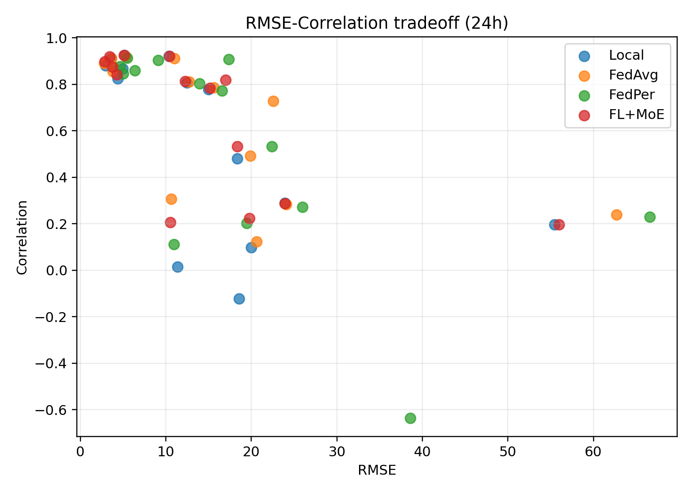

杩欏紶鏁ｇ偣鍥惧€煎緱鍗曠嫭璇存槑銆傛í杞存槸 `RMSE`锛岃秺寰€宸﹁秺濂斤紱绾佃酱鏄?`corr`锛岃秺寰€涓婅秺濂姐€?
鐞嗘兂鏂规硶搴旇鎶婄偣浜戞帹鍚戔€滃乏涓婅鈥濄€備粠鍥句腑鐪嬶細

- `FL+MoE` 鐨勫鏁扮偣姣?`FedAvg` 鏇撮潬宸︼紝鍚屾椂骞舵病鏈夋槑鏄剧壓鐗茬浉鍏虫€с€?- `FedPer` 鐨勭偣浜戝垎鏁ｅ害鏈€澶э紝鍙充笅鍖哄煙鍑虹幇鏇村鏋佺鐐癸紝璇存槑瀹冩棦瀹规槗鍑虹幇澶ц宸紝涔熷鏄撲涪澶辨尝鍔ㄧ粨鏋勩€?- `Local` 鍜?`FL+MoE` 鍦ㄤ竴浜涘洶闅剧珯鐐逛笂浣嶇疆鎺ヨ繎锛屼絾 `FL+MoE` 鏁翠綋鏇寸ǔ銆?
杩欒鏄?`FL+MoE` 骞朵笉鏄畝鍗曞湴鍋氫簡鏇存縺杩涚殑骞虫粦锛岃€屾槸鍦ㄤ繚鎸佽秼鍔胯窡韪兘鍔涚殑鍚屾椂锛岄檷浣庝簡璇樊骞呭害銆傝繖涓€鐐逛篃瑙ｉ噴浜嗗畠涓轰粈涔堣兘鍚屾椂鏀瑰杽 `RMSE`銆乣R2` 鍜?`WAPE`銆?
## 11. 缁撴灉搴旇濡備綍琛ㄨ堪寰楁洿涓ヨ皑

濡傛灉瑕佹妸杩欑粍缁撴灉鍐欒繘璁烘枃銆佹眹鎶ユ垨绛旇京涓紝寤鸿浣跨敤濡備笅琛ㄨ堪鏂瑰紡锛?
- `FL+MoE` 鍦?`1h / 6h / 24h` 涓変釜棰勬祴姝ラ暱涓婇兘鍙栧緱浜嗘渶浼樼殑鎬讳綋鍧囧€肩粨鏋溿€?- 鍏朵紭鍔垮湪 `6h` 棰勬祴鏈€鏄捐憲锛岀珯鐐圭骇鑳滃満鍜屾樉钁楁€ф楠岄兘琛ㄦ槑瀹冩槑鏄句紭浜?`Local`銆乣FedAvg` 鍜?`FedPer`銆?- 鍦?`24h` 棰勬祴涓紝`FL+MoE` 浠嶄繚鎸佺患鍚堟渶浼橈紝浣嗙浉瀵?`Local` 鐨勭粺璁′紭鍔挎湁鎵€鍑忓急锛岃鏄庨暱鏃堕娴嬩粛鐒舵槸褰撳墠绯荤粺鐨勬牳蹇冮毦鐐广€?- 椋庣數绔欑偣鐗瑰埆鏄皯鏁伴珮娉㈠姩绔欑偣锛屾槸鏁翠綋璇樊鐨勪富瑕佹潵婧愶紱`FL+MoE` 鍦ㄨ繖浜涘洶闅惧満鏅腑浣撶幇鍑轰簡鏇村ソ鐨勭ǔ鍋ユ€с€?
## 12. 鐜伴樁娈电殑涓嶈冻涓庡悗缁缓璁?
灏界 `FL+MoE` 琛ㄧ幇鏈€濂斤紝杩欑粍瀹為獙浠嶇劧鏆撮湶鍑轰竴浜涢檺鍒讹細

1. `24h` 椋庣數棰勬祴浠嶇劧寰堥毦銆?   鍗充究鏈€浼樻柟娉曞湪椋庣數 `24h` 涓婄殑 `R2` 涔熷彧鏈夋帴杩?`0` 鐨勬按骞筹紝璇存槑杩樻湁杈冨ぇ鎻愬崌绌洪棿銆?
2. 涓?`Local` 鐨勫樊璺濆苟闈炴墍鏈夋寚鏍囬兘鏄捐憲銆?   杩欐剰鍛崇潃褰撳墠 `FL+MoE` 宸茬粡璇佹槑鈥滃€煎緱鍋氣€濓紝浣嗚繕娌℃湁寮哄埌瓒充互鍦ㄦ墍鏈夊満鏅畬鍏ㄦ浛浠ｆ湰鍦版ā鍨嬨€?
3. `FedPer` 鐨勭粨鏋滈潪甯镐笉绋冲畾銆?   杩欐彁閱掓垜浠紝绠€鍗曠殑涓€у寲鑱旈偊缁撴瀯鏈繀閫傚悎杩欑椋庡厜娣峰悎銆佸紓璐ㄦ€у己鐨勯娴嬩换鍔°€?
4. 瀹為獙杞暟浠嶈緝灏戙€?   褰撳墠璁剧疆鍙湁 `3` 杞仈閭﹁缁冿紝缁撹宸茬粡鏈夎緝娓呮櫚瓒嬪娍锛屼絾鑻ヨ杩涗竴姝ュ寮哄彲淇″害锛屽缓璁鍔犺疆鏁板苟閲嶅澶氭闅忔満绉嶅瓙瀹為獙銆?
鍚庣画鍙互浼樺厛灏濊瘯锛?
- 澧炲姞鑱旈偊璁粌杞暟锛岃瀵?`FL+MoE` 鐩稿 `Local` 鐨勫樊璺濇槸鍚︾户缁墿澶с€?- 閽堝椋庣數闅剧珯鐐瑰仛涓撳璺敱鎴栫珯鐐硅仛绫诲垎鏋愶紝楠岃瘉 `MoE` 鏄惁鐪熺殑瀛﹀埌浜嗙珯鐐圭被鍨嬪樊寮傘€?- 瀵?`24h` 鍦烘櫙鍔犲叆鏇村己鐨勫灏哄害鏃跺簭寤烘ā鎴栧鐢熸皵璞＄壒寰侊紝浠ユ敼鍠勫嘲鍊煎帇缂╅棶棰樸€?
## 13. 鎬荤粨

`unified_benchmark_v4` 鐨勭粨鏋滃彲浠ユ鎷负涓€鍙ヨ瘽锛?
`FL+MoE` 鍦ㄨ繖缁勯鍏夋贩鍚堣仈閭﹂娴嬩换鍔′腑琛ㄧ幇鍑轰簡鏈€濂界殑缁煎悎绮惧害涓庣ǔ鍋ユ€э紝灏ゅ叾鍦?`6h` 鍜?`24h` 涓暱鏃堕娴嬮噷浼樺娍鏄庢樉锛涗笉杩囧湪鏈€寮哄熀绾?`Local` 闈㈠墠锛屽叾浼樺娍鏇村浣撶幇鍦ㄢ€滄€讳綋鏇翠紭銆佺珯鐐规洿绋炽€侀暱鏃舵洿寮衡€濓紝鑰屼笉鏄€滄墍鏈夊満鏅兘鏄捐憲纰惧帇鈥濄€?

杩欎篃鏄竴涓瘮杈冨彲淇°€佹瘮杈冩垚鐔熺殑瀹為獙淇″彿锛氭ā鍨嬫敼杩涙槸鐪熷疄瀛樺湪鐨勶紝鑰屼笖鏀硅繘浣嶇疆鎭板ソ鍑虹幇鍦ㄦ渶闅剧殑涓暱鏃躲€侀鐢点€侀珮寮傝川鎬у満鏅腑銆?
